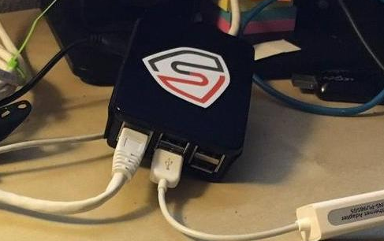

# Overview



While working on [berry-sense](https://github.com/mellow-hype/berry-sense) and learning about network traffic analysis recently, I had the need for a dedicated device to use as an Ethernet bridge/tap for capturing traffic. This would give me a chance to test the Raspberry Pi's performance while performing traffic captures, as well as produce a usable device for performing simple traffic analysis.

These are the configurations I made to accomplish this.
*Note: This tutorial assumes you're comfortable working in the terminal since everything below will be done on the command-line. It also assumes you know how to install Raspbian to an SD card for use in a Pi.*

## What's a network tap?
A network tap is a device that is typically placed between two endpoints on a network to 'tap into the wire' and sniff/intercept the traffic passing by. All packets are forwarded to their intended destination so that there is no disruption of connectivity. Network taps are meant to be 'invisible' on the network and not modify the traffic in any way, since they are usually used to perform troubleshooting or analysis.

A typical Ethernet tap has three ports: two for bridging the two endpoints and one for monitoring. The latter is where the person performing the traffic analysis plugs in and is able to see the traffic moving between the other two interfaces. 

# Setup
## Endpoint Bridge Ports
The RPi3 has only one Ethernet port, so it was necessary to add at least another. The only solution was to use a USB-to-Ethernet adapter, which luckily I had. In any case, they're relatively cheap and easy to find. 

Since a tap is supposed to be invisible on the network, I needed to have the interfaces configured so that the device could be dropped between any two network endpoints and begin forwarding traffic with little-to-no additional configuration. I decided to create a bridge interface to bridge both Ethernet ports and configure the bridge to be setup via DHCP, since it's the least likely to cause problems. 

_NOTE: It is important to note that the on-board Ethernet uses the USB bus to transfer data. This means both NICs will be sharing a single bus while transferring data. This will likely lead to packet loss and degrade performance, but for my simple purposes this was acceptable._

## Monitor Port
Usually there is a third Ethernet port to serve as the monitor port, but I didn't want to add another external device to minimize power consumption and overhead on the USB bus. Since there is a wireless NIC available, I decided I would use that as make-shift monitor port. 

To accomplish this, I decided to configure it to operate as an access point and set up an SSH server on the Pi. This way I could connect via WiFi, login via SSH, and monitor the traffic directly from the Pi.


# Putting It All Together
Here's a quick overview of the setup:
- Hardware: 
    - Raspberry Pi3
    - 16GB high-speed microSD storage
    - USB-to-Ethernet adapter
- OS: 
    - [Raspbian Jessie Lite](https://www.raspberrypi.org/downloads/raspbian/)
- Software:
    - hostapd
    - dnsmasq
    - bridge-utils
    - openssh
    - tcpdump

*Note*: You will need to have a display and keyboard connected to the Pi for the initial configuration.

## Configure Raspbian and Update
Once Raspbian was installed and I had booted into the OS, there were a few configuration changes that were necessary. This is all made very simple on Raspbian via the `raspi-config` script. This gives a nice menu in the terminal for configuring the system and enabling/disabling services. 

These are some of the settings I modified that you may also want to change. 

- Expand Filesystem (definitely do this!)
    - Internationalization options:
        - Change locale: en_US.UTF8 (for most people in the US)
        - Change timezone
        - Change keyboard layout: English US (again, most in the US)
        - Change WIFI Country: US (once again...)
    - Hostname

Note that Raspbian does not come with a US keyboard layout or locale enabled by default, so you will have to change those to the appropriate settings before continuing to avoid potential issues is you're in the US. **Don't change the default password from the raspi-config menu before setting your appropriate keyboard layout and rebooting, especially if you use symbols in your password.** You'll probably lock yourself out of the system. Once the correct settings have been configured and you have rebooted, **_do_ change the default password for the `pi` user**.

After making these changes, I updated the system.

```shell
$ sudo apt-get update && sudo apt-get upgrade
```

## Configure the Wireless AP + SSH
Next, I set up the the wireless interface(`wlan0`) to serve as an access point using `hostapd` and `dnsmasq`. 

### Configure `wlan0` IP settings
I started by configuring `wlan0` with static IP settings. I saved a copy of '/etc/network/interfaces' as 'interfaces.orig' to preserve the default settings and edited the original file. I commented out the existing block for `wlan0` and added these settings:

```config
iface wlan0 inet static
    address 10.0.1.1
    network 10.0.1..0
    netmask 255.255.255.0
    broadcast 10.0.1.255
```

I restarted the network to apply the changes (this can also be done via reboot):
```shell
$ sudo /etc/init.d/networking restart
```

### Install and configure hostapd + dnsmasq
`hostapd` is used to turn the wireless interface into an access point and `dnsmasq` will serve IP addresses to clients via DHCP.

I began by installing both tools:
```shell
$ sudo apt-get install hostapd dnsmasq
```

#### hostapd
I created a config file for `hostapd` with these settings and saved it at '/etc/hostapd/hostapd.conf'.

```config
# wireless interface to create access point
interface=wlan0
# driver for the built-in wifi in the Pi 
driver=nl80211
# SSID
ssid=berry-sensor
# Use the 2.4GHz band
hw_mode=g
# Channel to use
channel=1
# Required settings for built-in wireless
ieee80211n=1
wmm_enabled=1
ht_capab=[HT40][SHORT-GI-20][DSSS_CCK-40]
# Accept all MAC addresses
macaddr_acl=0
# Use WPA authentication
auth_algs=1
# Require clients to know the network name
ignore_broadcast_ssid=0
# Use WPA2
wpa=2
# Use a pre-shared key
wpa_key_mgmt=WPA-PSK
# The network passphrase (this is just an example, make sure to change this)
wpa_passphrase=raspberry
# Use AES, instead of TKIP
rsn_pairwise=CCMP
```

Next, I edited '/etc/default/hostapd' and uncommented the following line and pointed it to the config file I had created.
```config
DAEMON_CONF="/etc/hostapd/hostapd.conf"
```

Finally, I enabled the `hostapd` service so that it is started at boot.
```shell
$ sudo systemctl enable hostapd
```

#### dnsmasq
Next, I renamed the default `dnsmasq` configuration file at '/etc/dnsmasq.conf' to 'dnsmasq.conf.orig' to preserve the original settings. I created a new file with the following settings where the default config file used to be ('/etc/dnsmasq.conf').

```config
interface=wlan0         # Use interface wlan0  
listen-address=10.0.1.1 # Explicitly specify the address to listen on  
bind-interfaces         # Bind to the interface to make sure we aren't sending things elsewhere   
domain-needed           # Don't forward short names  
bogus-priv              # Never forward addresses in the non-routed address spaces.  
dhcp-range=10.0.1.2,10.0.1.16,6h # DHCP range settings
```
*Note*:These IP addresses should match the settings used to configure the static IP settings of the wireless interface.

Finally, I enabled the `dnsmasq` service so that it is started at boot.
```shell
$ sudo systemctl enable dnsmasq
```

### Enable the SSH server
At this point, I enabled SSH on the Pi so that I could access it once I had connected as a wireless client. I did this via the menus provided by `raspi-config` under Advanced Options>SSH.

### Reboot
Once everything had been configured, I rebooted the Pi so that all settings would be applied and the services would be started. I was able to associate with the AP and ssh into the Pi.

## Configure the Ethernet NICs
The final step was to create a bridge interface to bridge the two Ethernet interfaces. This way the bridge interface can be monitored directly and traffic is forwarded automatically. The bridge interface is configured via dhcp, though this can be changed to static settings easily to match the network's configuration.

I connected the USB-to-Ethernet adapter and proceeded.

### Creating the Bridge Adapter
I began by installing `bridge-utils` to create the bridge interface.
```shell
$ sudo apt-get install bridge-utils
```
Next, I edited '/etc/network/interfaces' to add an entry for the new bridge interface (`br0`) and disable the existing entry for `eth0` and the new `eth1` interface, since the `br0` will bring up the interfaces it is assigned. 

This was my final '/etc/network/interfaces' file, with the settings for the wireless interface from before included:
```config
# /etc/network/interfaces
# loopback interface
auto lo
iface lo inet loopback

# wireless AP interface
allow-hotplug wlan0
iface wlan0 inet static
    address 10.0.1.1
    network 10.0.1..0
    netmask 255.255.255.0
    broadcast 10.0.1.255

# bridge interface ( eth0 <-> eth1 )
auto br0
iface br0 inet dhcp
        bridge_ports eth0 eth1
        bridge_stp off
        bridge_fd 0
        bridge_maxwait 0

# These interfaces are disabled since br0 will bring them up itself.
# iface eth0 inet manual
# iface eth1 inet manual
```

### Reboot
I rebooted the Pi to enable the new network settings and bring up the bridge interface. 

# Testing Things Out
With everything installed and properly configured, it was time to test it out. 

I associated to the Pi via wifi and logged in via ssh. I confirmed that the bridge interface was up before proceeding. I then connected an Ethernet cable from my laptop to `eth1` and another cable from my gateway device to `eth0`. My laptop received an IP address via DHCP and I confirmed that I was able to reach the Internet. 

Finally, I began a capture using `tcpdump` on `br0` and was able to see the traffic going between my laptop and the gateway device. I did notice quite a few dropped packets while performing captures, so I will have to look into that further to see if I can tweak anything to improve performance.

### Related Links/Resources
- [Ubuntu Docs - NetworkMonitoringBridge](https://help.ubuntu.com/community/NetworkMonitoringBridge#head-a2ca1bc974f893e50dcc31e4959c12bea7ca9fc2)
- [Using Your Raspberry Pi as a Wifi AP](https://frillip.com/using-your-raspberry-pi-3-as-a-wifi-access-point-with-hostapd/)
